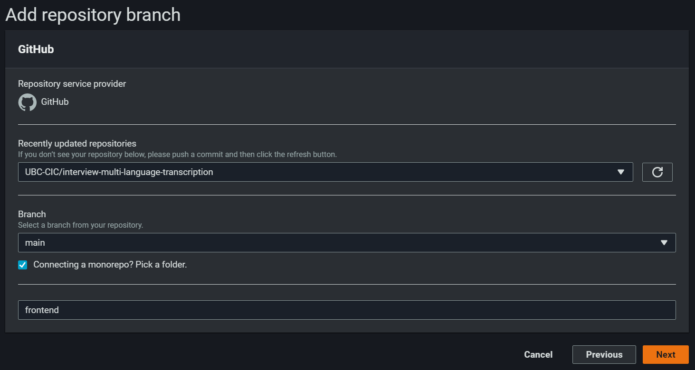
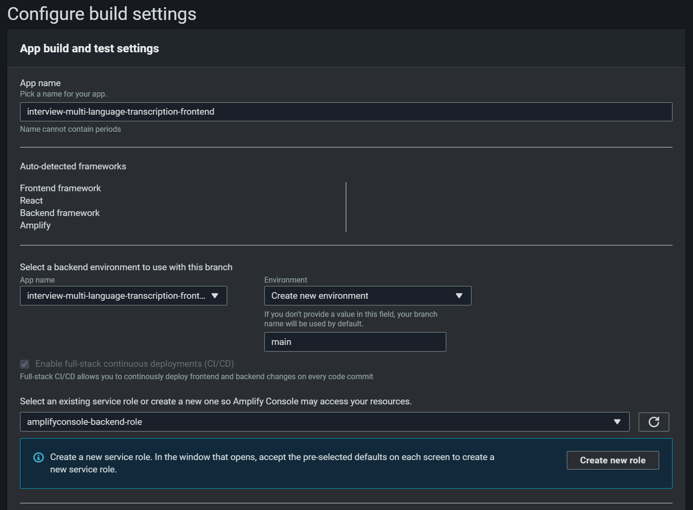

## Frontend deployment

You will need the following resources before deploying:
* [AWS Account](https://aws.amazon.com/account/)
* [GitHub Account](https://github.com)

1) Fork and clone this repository into your Github account.
2) From the AWS Amplify page in the AWS Console, select **Host web app** under the **New app** dropdown, and select 
   Github as the repository option.
3) After authenticating into your Github account, select the forked repository under the repository dropdown. Leave 
   the default branch as is. Select the **frontend** mono-repository
   
   NOTE: You will need to give permissions to the Amplify service to access your github account

4) On the next page, **App build and test settings**, keep the default build settings. You can rename the app name.
5) Select **Create new environment** under the **Select a backend environment** dropdown and type **main**, 
then select your AWS Amplify service role in the following dropdown if one exists; if not, Select 
   'Create new role' and quickly create one using the default settings and refresh the role selection.

6) Review the settings and click **Save and deploy**, and wait for the deployment build to complete, which will take 
   some time.

Within Amplify Console, you should see an auto-generated URL under **Frontend environment** - that is the URL used 
to access the frontend build. You can now create your user accounts and log in via the URL.
